# Blue CTF Writeup

## About the Capture the Flag 
Name: Blue\
Difficulty: Easy\
Author: [DarkStar7471](https://tryhackme.com/p/DarkStar7471)\
Link: [LINK TO CTF](https://tryhackme.com/room/blue)

## Start of writeup

### Introduction
The Blue CTF is a vulnerable Windows machine where we'll be leveraging common misconfigurations issues that happen in Windows to gain access to the machine and raise our user privileges. From there we'll be collecting a set of keys to finish the room and earn our badge on TryHackMe. 

### Goal of the CTF
The goal of the CTF is pretty straight forward and explained in the separated titles of the room. The first step is to perform reconnaissance, this is gonna be done by using NMAP and potentially other network scanners to see if there's an in into the system, a port running outdated software etc. The next step is to gain access through this exploit to then use it to escalate and eventually crack the password to gain access to the user. From this point we're tasked with finding three flags to complete this CTF.

### Part 1 - Recon
The first step to every CTF is to know what you're dealing with. Enumeration or reconnaissance, whatever you want to call it, it's important to know who your target is, what your target is running, what weaknesses it has. This is all done in this phase. In this case we'll be using NMAP to answer the two questions in this part of the room. A hint is given which command to execute in NMAP. The command that's used is shown below.

```python
nmap -sV -vv --script vuln TARGET_IP
```

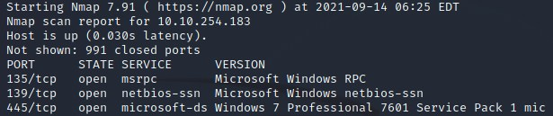

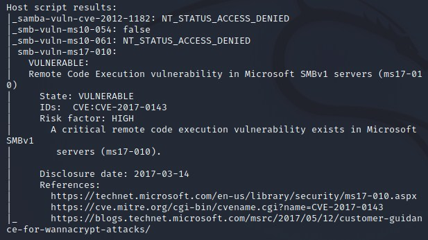

After running the scan on the target machine we see the following results as shown in the screenshots above. There are nine ports open, three of which are under port 1000. Scrolling down a bit further it showed the results from the vuln script that was included in the scan. It shows there's a vulnerability, smb-vuln-ms17-010, which is vulnerable for Remote Code Execution.

### Part 2 - Gain Access
In this part of the CTF we're going to exploit the vulnerability that we found in the previous step, ms17-010. This is easily done by using searchsploit and metasploit. These tools allow you to look for an exploit for the found vulnerability and exploit it. After searching for "ms17-010" on searchsploit, several exploits popped up. We then jumped into metasploit, searched for this exploit and used it to gain access to the machine. The next step according to the room is turning the shell into a meterpreter but since this room is almost three years old, this is outdated. The exploit already has a built in meterpreter instead of a shell now.

```python
set RHOST <target_ip>
exploit
```

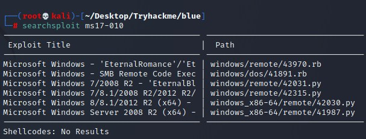

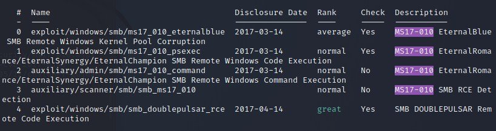

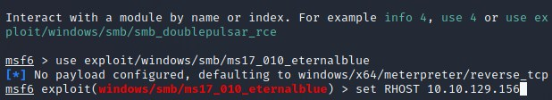

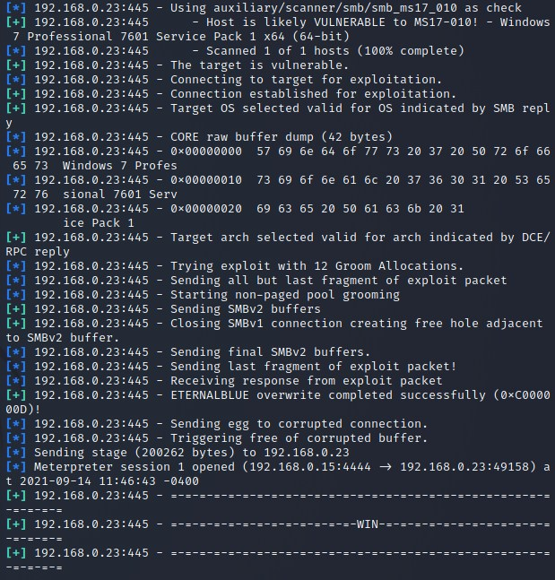

### Part 3 - Escalate
As mention previously, this part of the CTF is now outdated because the original metasploit exploit now already contains the ability the turn the shell into a meterpreter. Therefor we'll skip this step and will immediately go to step four, Cracking. 

### Part 4 - Cracking
In this fourth part of the room, we'll be getting to cracking the hash we'll be retrieving after getting the meterpreter escalation. The hash is simply retrieved by executing the "hashdump" command in the meterpreter window. This will return the hash of Jon:1000. Jon is the user of interest and the account we'll be cracking into. 

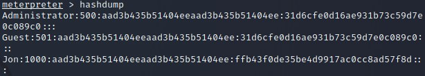

The way we're going to crack this hash is by using hashcat. Hashcat is a hash cracking tool which can handle a lot of different hashes and retrieve the password by brute forcing it. The command we're going to use is shown below. After a 5 second brute force, we're given the password. Now it's time for the next step, the most fun part, finding the flags!

```python
hashcat -m 1000 hash.txt /usr/share/wordlists/rockyou.txt
```

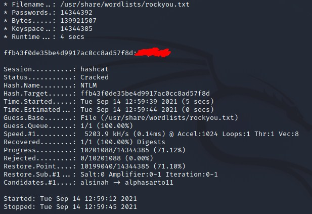

### Part 5 - Find flags!
In this final part of the room we'll be locating the three flags. For each flag we get a little hint where to find it (its still an easy room). According to the tip given by the author of the CTF, the first flag is found in the root of the system. Since C:/ is the root of a Windows machine, it'll be found there.

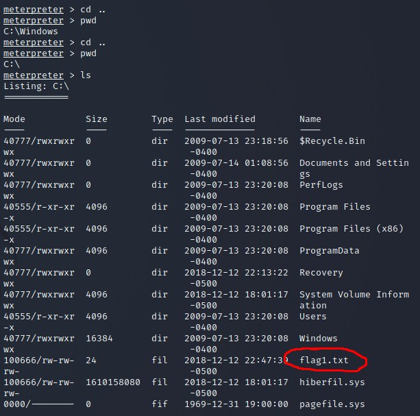

For the second flag the given tip is that it's stored in a location where passwords are stored. With a simple and quick google search it turns out this is the SAM (Security Account Manager) file. The location of this file is C:\WINDOWS\system32\config. Here you'll find flag 2. 

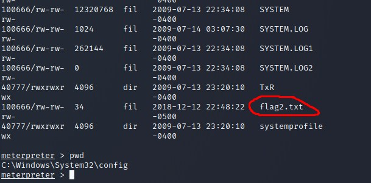

The third and final flag is located in an admin user location. This is more than likely in the users folder. But to simplify this, we'll be using the search command. This search allows you to find files that match the given criteria of the name of the file. After finding the final location of the file, C:\Users\Jon\Documents\flag3.txt, a simple "cat" command will reveal the contents of the flag.

```python
search -f flag*.txt
```

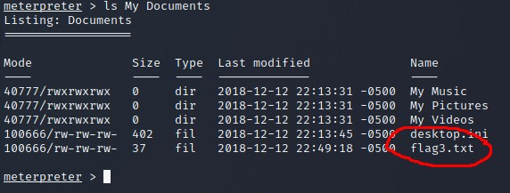


### Conclusion
To summarize this Capture the Flag challenge, it was a really fun and interesting challenge to do. Most CTF's focus on web applications, linux machines etc. so this was a nice, refreshing change. It was a nice CTF for beginners and I'd definitely recommend trying this as a beginner. Have fun and good luck with this CTF!