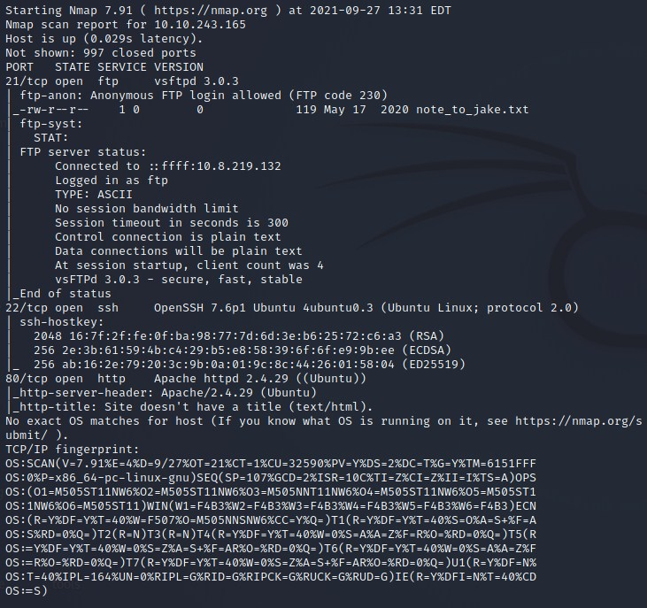
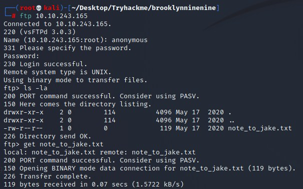
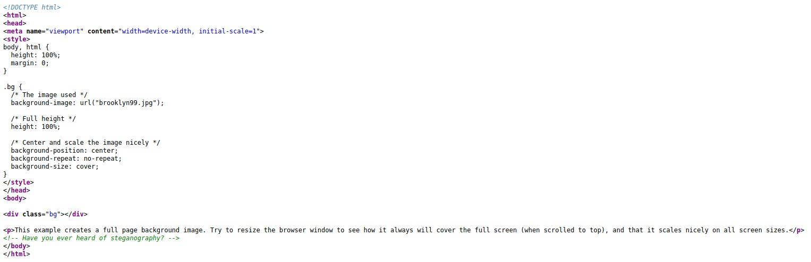
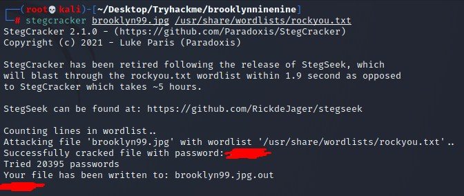
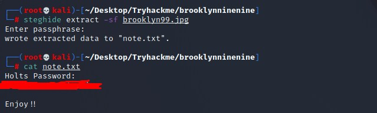
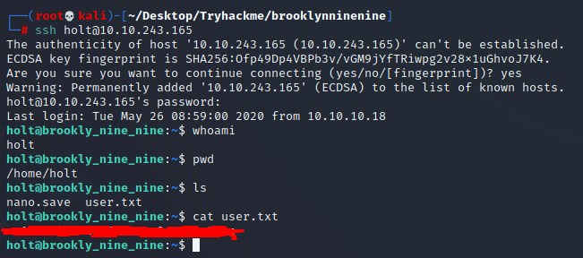
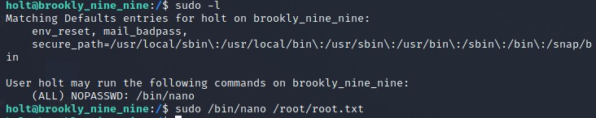
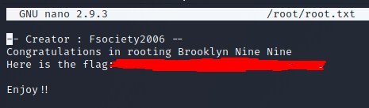

# Brooklyn 99 CTF Writeup

## About the Capture the Flag 
Name: Brooklyn 99\
Difficulty: Easy\
Author: [falconfeast](https://tryhackme.com/p/Fsociety2006)\
Link: [LINK TO CTF](https://tryhackme.com/room/brooklynninenine)

## Start of writeup

### Introduction
Today we'll be breaking into a Police Station! Okay, maybe not for real but we'll be targeting a system/CTF based on the police show, Brooklyn 99. A comedy show which involves many noteworthy characters that all work at a New York Police station. According to the author of this CTF, there's two ways of rooting this system, and we'll find out how!

### Goal of the CTF
The goal of this CTF is to get into the system by any means necessary, and once we're in the system, we're supposed to root it. On the way to rooting the system, we'll encounter two flags, a user flag and root flag.

### Flags 1 & 2 - User and Root Flags
Like we do with any CTF, the first step is for us to do some basic enumeration. We use NMAP for this to see what we're currently dealing with. It shows there's three ports open, a FTP, SSH and HTTP port. We'll be using DIRB to go through several directories of the HTTP page to find out more about it. Whilst the scan runs, we'll be logging into the FTP service with the "anonymous" account. This requires no password so we can skip that part. As seen in the screenshot it tells us there's a .txt file that might be on interest to us. It shows us that a potential user, "Jake", has a weak password for his credentials. This could easily be abused for let's leave it for now. The DIRB scan doesn't show anything interesting, so let's check out the webpage itself. It's a big image of the show Brooklyn99. With it comes some text, nothing special, but once we take a look at the source code of this HTML page, we're shown a comment, talking about steganography. Steganography is the art of hiding messages in images so it can be transported without the message being too obvious. This comment gives it away that the image might have a hidden message inside of it. We'll be using Steghide to retrieve the message from this image, but once we try to run it, it tells us we need a password. This was gonna be too easy that way. But luckily there's a way of cracking passwords for steganography images. We'll be using Stegcracker for this, using the rockyou.txt words. After a minute or two, we're given the password of the image. Let's try Steghide again, now it works! The message has been copied into a .txt file. The message contains the password for the user "holt". Now it's time to try to log into SSH with this username and password, which turns out to be a success! When we look at our path and the contents of it, we run into the user.txt file, which contains the flag!

The next step is rooting the machine. Let's see what we can use to escalate our privileges. When we do sudo -l we are shown that we can exploit nano with the sudo command. This means we can open any file on the target machine basically. In my experience in most CTFs, the root.txt file is located in the root directory. Executing the following command allows us to nano the root.txt file, giving us our last key!

### Conclusion
I finished this CTF within 30 minutes, catching both flags and rooting the machine. It's safe to say it was a very simple, but fun CTF. I didn't learn anything new but repeating the same steps constantly makes you better at things. I also liked the Brooklyn99 theme since I'm a personal fan of the show. Good luck and have fun with the CTF! 