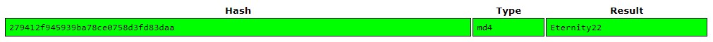

# Crack the Hash CTF Writeup

## About the Capture the Flag 
Name: Crack the Hash\
Difficulty: Easy\
Author: [ben](https://tryhackme.com/p/ben)\
Link: [LINK TO CTF](https://tryhackme.com/room/crackthehash)

## Start of writeup

### Introduction
The Crack the Hash CTF is not necessarily a classic CTF but more of a challenge where you are given multiple hashes that you need to crack and use to answer the questions given in the room. There is no system/target you need attack or gain access to, but to crack these hashes we are going to use some tools.

*Hash-identifier
*Hashcat
*Crackstation

### Goal of the CTF
As previously stated the goal of this CTF is cracking all the different hashes in the two parts of this room. Cracking these hashes allows us to answer the questions set in this room.

### Level 1
The first part of this room deals with the "easier" hashes that need to be cracked, every given hash will be put through a hash-identifier scan and then cracked by either hashcat or crackstation. On kali linux machines hash-identifier comes pre installed and is easy to use by just entering "hash-identifier" on the command line and feeding it the hash. Since this CTF only consists of performing a scan and cracking the hash, it will mainly contain screenshots of the scans and the answer to the question.


>"48bb6e862e54f2a795ffc4e541caed4d" Answer: easy


>"CBFDAC6008F9CAB4083784CBD1874F76618D2A97" Answer: password123


>"1C8BFE8F801D79745C4631D09FFF36C82AA37FC4CCE4FC946683D7B336B63032" Answer: 

This hash was the most interesting one out of the bunch. While putting it through the hash-identifier, there we no matches found. So we used [this](https://www.tunnelsup.com/hash-analyzer/) tool instead. This shows us that we're dealing with a bcrypt hash. The crackstation website doesn't support this form of hash so we have to use hashcat instead. In hashcat we need to specify what hash we need to crack, in this case bcrypt which got the number 3200 assigned to it. And of course what hash needs to be cracked, this is done by storing the hash in a .txt document. And we know that the password is four digits long, its important to specify this else it'll take literal days to finally crack this hash. In the screenshot below you can see it still takes 15ish hours to crack the hash. The command will look a little something like this:

```python
hashcat -m 3200 -a 3 hash.txt ?l?l?l?l
```


>"$2y$12$Dwt1BZj6pcyc3Dy1FWZ5ieeUznr71EeNkJkUlypTsgbX1H68wsRom" Answer: bleh




>"279412f945939ba78ce0758d3fd83daa" Answer: Eternity22


### Level 2
In this second part of the CTF it's noted by the author of the room that it's going to be more difficult than the previous hashes. Its advised to start making proper use of the hashcat tool now, because the online tools might now have the capability to crack these hashes.


>"F09EDCB1FCEFC6DFB23DC3505A882655FF77375ED8AA2D1C13F640FCCC2D0C85" Answer: paule


>"1DFECA0C002AE40B8619ECF94819CC1B" Answer: n63umy8lkf4i


>"$6$aReallyHardSalt$6WKUTqzq.UQQmrm0p/T7MPpMbGNnzXPMAXi4bJMl9be.cfi3/qxIf.hsGpS41BqMhSrHVXgMpdjS6xeKZAs02." Answer: waka99


>"e5d8870e5bdd26602cab8dbe07a942c8669e56d6" Answer: 481616481616

### Conclusion
This was a fun and interesting room where the hashes kept getting more and more difficult. It introduced us to the way hashes work, different type of hashes and tools like hash-identifier and hashcat. It also showed us that is you run into a hash during a penetration test when you have access to a database or something similar, it's possible to crack! Have fun and good luck with this CTF!