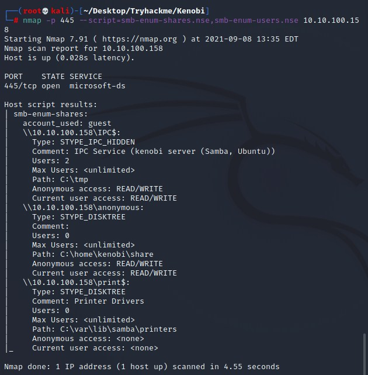
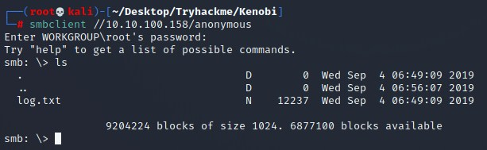
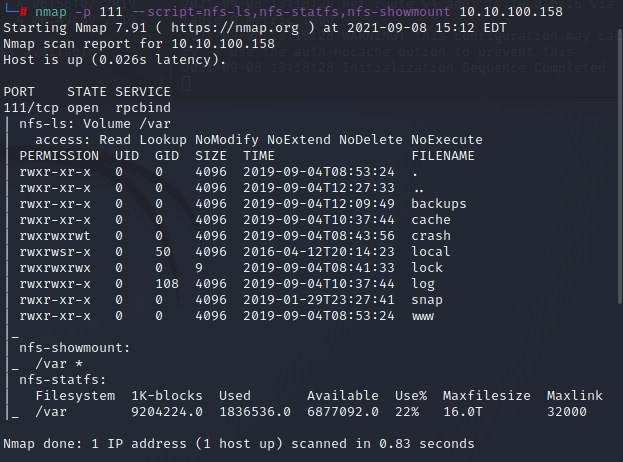
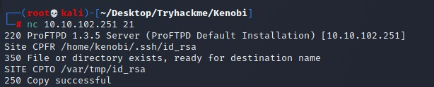

# Kenobi CTF Writeup

## About the Capture the Flag 
Name: Kenobi\
Difficulty: Easy\
Author: [TryHackMe](https://tryhackme.com/p/tryhackme)\
Link: [LINK TO CTF](https://tryhackme.com/room/kenobi)

## Start of writeup

### Introduction
The Kenobi Capture the Flag challenge is a fun and interesting CTF that is classed as easy on the TryHackMe website. According to the creator of this CTF, it covers manipulating a vulnerable version of ProFTPD to gain access and escalating your privileges to root via an SUID binary. Kenobi is a character from Star Wars so I am expecting many references throughout!

### Goal of the CTF
The CTF consists of three parts: 

*Enumerating Samba for shares;
*Gain initial access with ProFTPd;
*Privilege Escalation with Path Variable Manipulation

The room has multiple questions that need to be answered to get a 100% completion.

### Part 1 - Enumerating Samba for shares
In the first part of the CTF we're going to enumerate Samba. This is done with a special NMAP scan command as instructed in the CTF itself. This is used to answer the first question asked.

```python
nmap -p 445 --script=smb-enum-shares.nse,smb-enum-users.nse <ip>
```



>"Using the nmap command above, how many shares have been found?" Answer: 3

Now that we know how much shares there are, and what they're named, we can try and connect to one. The room sends us in the right direction by telling us we need to the anonymous share. We do this by typing out the following command:

```python
smbclient //<ip>anonymous
```



As shown in the console, a promt for a password is given but by simply pressing enter, you can skip by this. A simple "ls" command shows us the answer to the second question by displaying the file that we can see.

>"Once you're connected, list the files on the share. What is the file can you see?" Answer: log.txt

The next step is to get hold of this file and see what's inside of it. This is done by a simple smbget command which simply grabs the file and downloads it for you. 

```python
smbget -R smb://<ip>/anonymous
```

This file contains a lot of interesting information like how a SSH key is generated for Kenobi and information about the ProFTPD server running on port 21, which answers the next question.

>"What port is FTP running on?" Answer: 21

The next and final step for this part of the CTF is performing a NMAP scan to see the mount being used to a network file system. The command used for this is also given by the author of the room. By executing this command we get answer to the final question of this part of the CTF.

```python
nmap -p 111 --script=nfs-ls,nfs-statfs,nfs-showmount <ip>
```



>"What mount can we see?" Answer: /var

### Part 2 - Gain initial access with ProFTPd
In this step we're going to try to gain access to the system over FTP on port 21. After doing the original NMAP scan it showed that we're dealing with FTP on port 21 with the ProFTPd software running, with version 1.3.5. To find a weakness in this version of the software, we're going to repeat the steps that we done in the "Basic Pentest: 1" and use searchsploit to find a weakness in the system. After performing that command we can answer the first two questions:

>"What is the version?" Answer: 1.3.5

>"How many exploits are there for the ProFTPd running?" Answer: 4

The search shows four weaknesses, the exploit we're going to target is the mod_copy module. The module implements two commands that are used to copy files from one place to another on the server it's being hosted on. Anyone can leverage these commands to copy files from any part of the filesystem. This is done by a simple NetCat command with the target ip and the port you wanna target, in this case 21.

```python
nc <ip> 21
SITE CPFR /home/enobi/.ssh/id_rsa
SITE CPTO /var/tmp/id_rsa
```



The reason we moved the id_rsa file to /var is because it's mounted, as we discovered in part 1. From this point its simple to copy the directory to our own machine and use the ssh key that we obtained to access the system through ssh. This is a pretty simple process done with only a few simple commands:

```python
mkdir /mnt/kenobiNFS
mount <ip>/var /mnt/kenobiNFS
ls -la /mnt/kenobiNFS
```

```python
cp /mnt/kenobiNFS/tmp/id_rsa
chmod 600 id_rsa
ssh -i id_rsa kenobi@<ip>
```

After you manage to gain access using SSH, you'll be able to do a simple "ls -la" command and will see the user.txt file which contains the answer to the last question of this part.

>"What is Kenobi's user flag?" Answer: cat user.txt

### Part 3 - Privilege Escalation with Path Variable Manipulation
The third and final part of this CTF involved the usage of SUID. We're tasked with finding a file that's out of the ordinary for the first question of this part. The author tells us to execute a command which will answer the question, it returns a list of several binaries. 

```python
find / -perm -u=s -type f 2>/dev/null
```

The binary that stands out the most is the /usr/bin/menu binary. The reason being is that menu isn't a known service that is found on Linux systems, you need to have some Linux knowledge for this. If this has been created by the creator of this system, its very possible this binary contains errors and escalation privileges.

>"What file looks particularly out of the ordinary?" Answer: /usr/bin/menu

>"Run the binary, how many options appear?" Answer: 3

The step after this is thoroughly described in the room itself, quoting the author of the CTF: "We copied the /bin/sh shell, called it curl, gave it the correct permissions and then put its location in our path. This meant that when the /usr/bin/menu binary was run, its using our path variable to find the "curl" binary.. Which is actually a version of /usr/sh, as well as this file being run as root it runs our shell as root!" This is done with the following commands:

```python
cd /tmp
echo /bin/sh > curl
chmod 777 curl
export PATH=/tmp:$PATH
/usr/bin/menu
```

The final step is using cat on the root.txt file and you've just completed the CTF by answering the last question!

>"What is the root flag (/root/root.txt)?" Answer: cat root.txt

### Conclusion
My thoughts on this CTF is that it was very useful. It thought us new techniques and it had us reapply old techniques that we learned in previous CTFs. The guidance throughout the CTF was nice at times but it did felt like I was reading a writeup more than being offered a challenge. All in all it's a good CTF to try out and the rating easy definitely applies here. Good luck and have fun with this CTF!