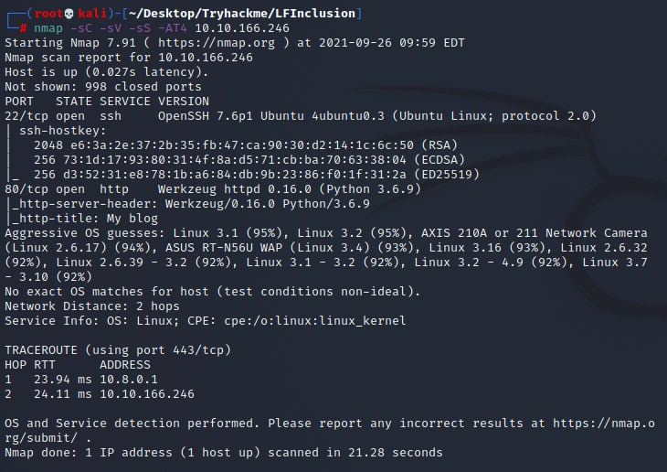
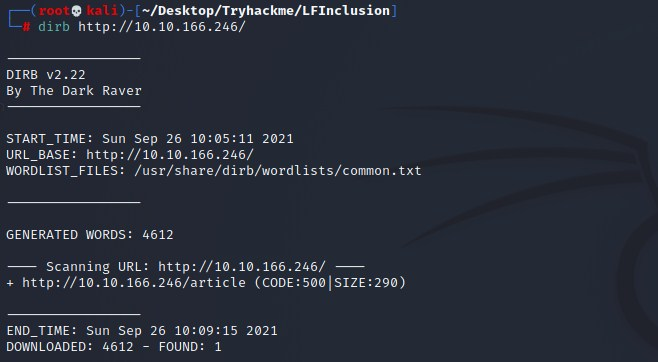
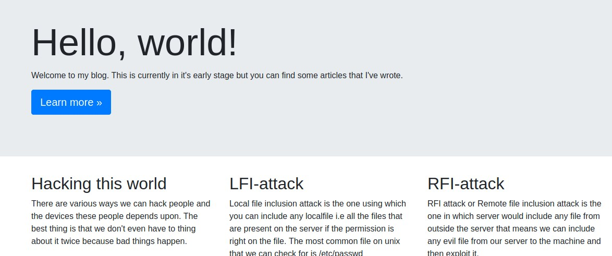
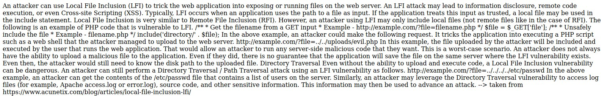
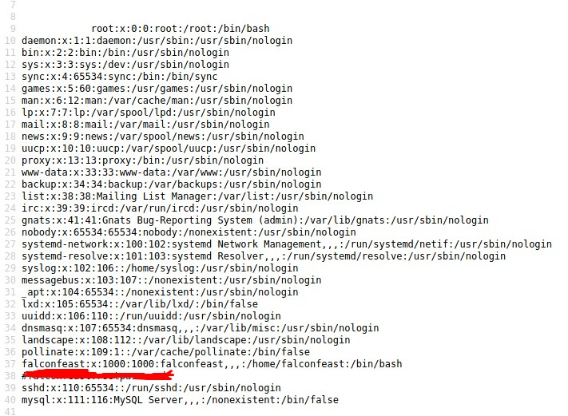
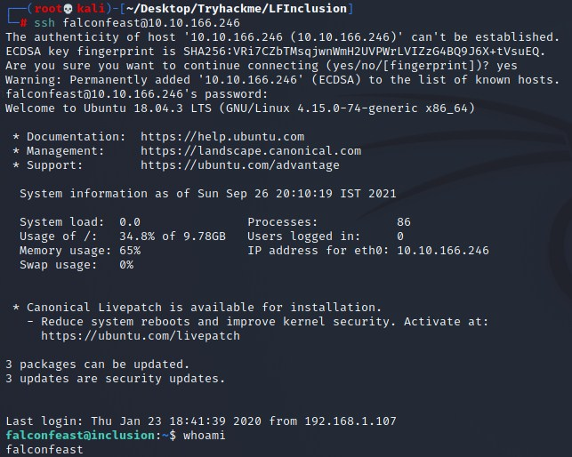
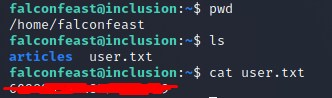
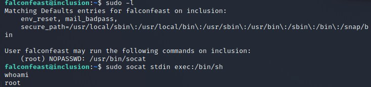
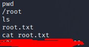

# LFI Inclusion CTF Writeup

## About the Capture the Flag 
Name: LFI Inclusion\
Difficulty: Easy\
Author: [falconfeast](https://tryhackme.com/p/falconfeast)\
Link: [LINK TO CTF](https://tryhackme.com/room/inclusion)

## Start of writeup

### Introduction
LFI Inclusion is a beginner level CTF made for people who want to get to know how to exploit the Local file inclusion vulnerability. By abusing this vulnerability we'll try to get root access to the system we're targeting. During this process we're going to try and find two different flags. A user flag and a root flag.

### Goal of the CTF
The goal of this CTF is simple, find and read the two different flags that are hidden in the system. The user and root flag.

### Flag 1 & 2 - Root IT
The first thing we'll be doing like with every CTF is enumeration. We'll be using NMAP to scan the target and see what pops up and what we can use or abuse from that point. After the NMAP scan it is shown that there's currently two services running. SSH and a HTTP website. We'll obviously be running a Directory Buster (DIRB) scan to check for any interesting directories. While that's running, let's inspect the website! Whilst browsing the website, we run into a blog like website that consists of different articles that you can click on. Since this room focusses on LFI, that's the article that draws my interest.

Reading through the story in this article, it's shown how LFI is used in the most common of ways, would this work on this web application? Let's try it out. Going to the website of the ip, "10.10.166.246/article?name=../../../../etc/passwd", with the path traversal part added into it. This indeed works and we're shown multiple directories. After making this more readable, we're shown a comment that tells us the username:password of a user. When trying this username and password in SSH, we're allowed in and are given access to a normal user account called falconfeast. We're immediately placed in the user folder where the user.txt file is located, giving us our first flag. 

Now that we got the first flag, it's time to find the second one, the root flag. The first thing we do to see if we can escalate our privileges is the "sudo -l" command. This shows us that we can indeed use a sudo, sudo socat. When we go to GTFObins and look for this directory, there is indeed a way to sudo into root access. This is done with the following command: "sudo socat stdin exec:/bin/sh". This allows us to have a root shell. We then navigate to the root folder where the root.txt file is located, completing our search for the two flags.

### Conclusion
This was a very simple and quick CTF challenge. Even though it was a simple CTF, it was still very fun and interesting to do. After making the path traversal possible, it was very straight forward from then on out. Logging into the target with the provided SSH credentials allowed us to find the first flag and with a simple privilege escalation we got the root flag. This is definitely a recommendation for people who are new into cybersecurity! Have fun and good luck with the CTF! 