# Linux Privilege Escalation CTF Writeup

## About the Capture the Flag 
Name: Lazy Admin\
Difficulty: Easy\
Author: [MrSeth6797](https://tryhackme.com/p/MrSeth6797)\
Link: [LINK TO CTF](https://tryhackme.com/room/lazyadmin)

## Start of writeup

### Introduction
The Lazy Admin CTF is a small CTF which evolves around abusing a vulnerable machine, gain access to the machine and gain root access. The CTF is created my MrSeth and has been labeled as an easy Capture the Flag Challenge.

### Goal of the CTF
The goal of the CTF is to gain access to the machine, elevate your privileges and find the user flag and root flag.

### Flag 1 - User Flag
The first step in most CTFs is enumeration, and here it will be no different. We'll first do an NMAP scan where we can see what ports are open/being used, what services are running on it and what version of software is running on it. The scan shows that there's a service running on port 22, which is of course SSH. But we're also shown that there's a HTTP server running on port 80. This calls for a DIRB scan, going through a lot of posibilities for directories on the website. While that's running, let's visit the website. It's a basic Ubuntu website that doesn't say a lot. During the scan we're given an interesting directory, /content/index.php. It shows that the website is running SweetRice, a content management system (CMS), that I personally have never heard of. When we look on searchsploit for vulnerabilities for this CMS, we see two interesting ones: Backup Disclosure and Cross-Site Request Forgery / PHP Code Execution.

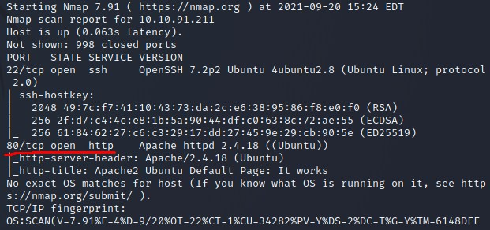

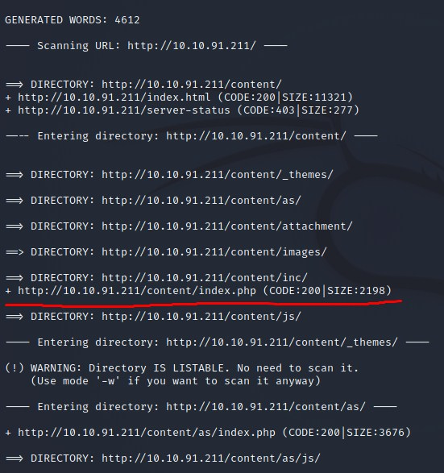

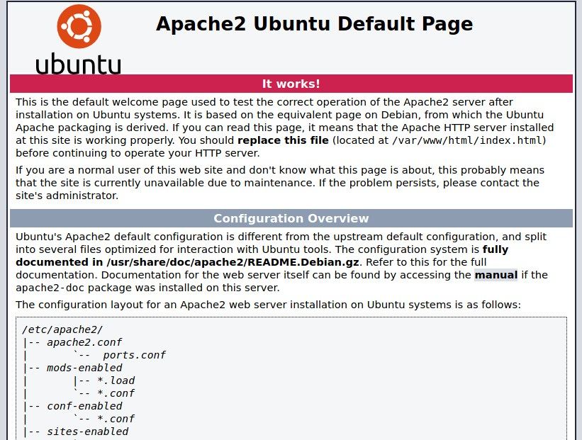

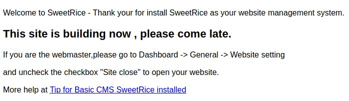

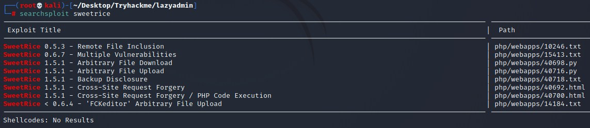

The Backup Disclosure exploit tells us that we can visit the /inc/mysql_backup on the SweetRice website to get a copy of the MySQL database. When we take a closer look at the file we just downloaded, it shows a lot of interesting information, especially after the "passwd" entry. We see a string of different characters, which is probably a hash. When using this supposed hash on a tool like CrackStation, we're returned a plaintext password and the type of hash it was, MD5. So we got a plaintext password, what now? During the DIRB scan we were also shown that there's a /content/as directory which is the admin login panel. We use the password we retrieved and the username we found in the SQL db, the user's name is manager. This allows us to log into the application and we get access to the admin panel.

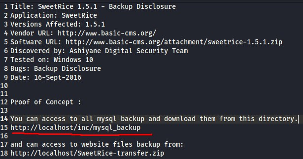

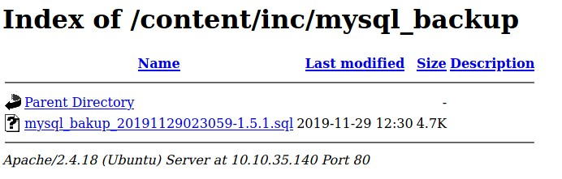

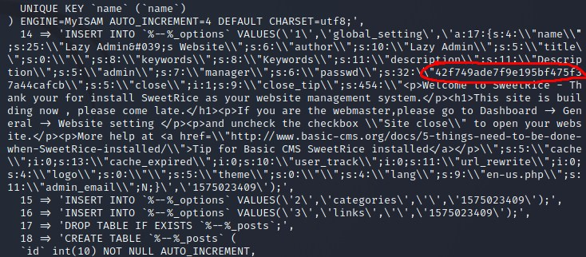

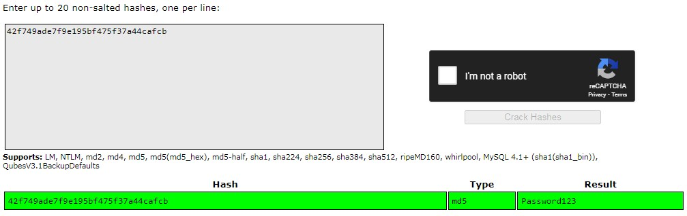

Once we're in the admin panel, we'll be using the other exploit that we found earlier, the RCE one. We'll do this by abusing the adverts from SweetRice. Once we navigate to the advert panel we see that there are two fields we can add input into. We'll be using the advert field to send malicious php code. The code we'll be using the the code from PentestMonkey, which will allow us to setup a basic shell. We'll be curling the website in our prompt which will set up the listener for which gives us a unprivileged shell! Once in this unprivileged shell it's easy for us to find the user.txt flag in the /home/itguy directory. 

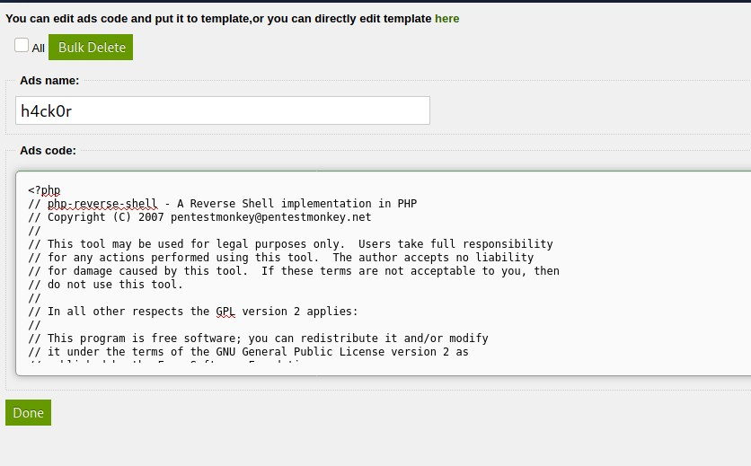

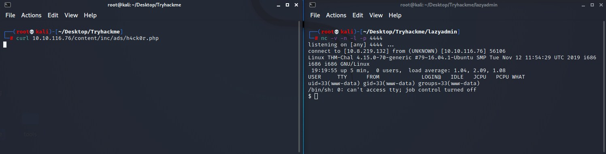

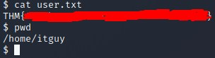

### Flag 2 - Root Flag
Now that we have an unprivileged shell we can work from, it's time to escalate our privileges to a root account. The first step in doing this is checking our current sudo abilities. We do this with a simple "sudo -l". This shows that there's a file we can execute perl with the sudo command. This file is /home/itguy/backup.pl. When we cat this file the content of the file is shown in the screenshot below. This shows us that this file will execute another file, /etc/copy.sh. When we check out the content of this file, I was surprised with the content. It contains a privelege escalation script which if fully done and all it needs is our own ip address. The issue we run into here is that there's no working editor programs on the machine, no nano, no vim. So we have to go old-school! We'll be echo'ing the contents of the file to be saved in the /etc/copy file, allowing us to later execute the file since it's called in the backup.pl file. We then start another netcat listener for port 5554 on our own Kali Box. Now that is setup, we can execute the backup.pl file. This allows us to now have a root shell. Now its time to navigate towards the root directory containing the root.txt file, giving us the final flag!

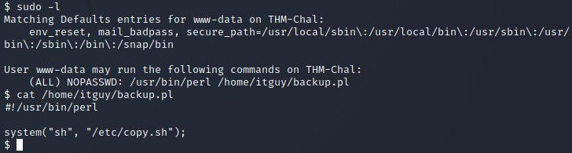

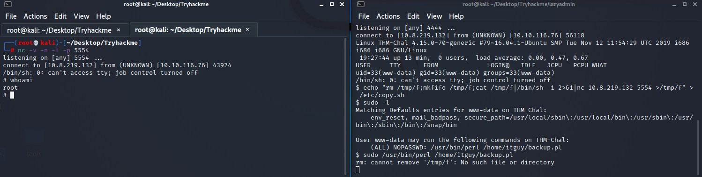

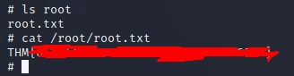

### Conclusion
This was a very fun CTF to do, mainly because there were zero to no guidance, just what types of flags you need to locate and cash in. It was labeled as easy, which is a fair rating because the only thing we did was find an exploit for the CMS and elevate your privileges on the machine, which was already typed out in a file! Good luck and have fun with this Capture the Flag!