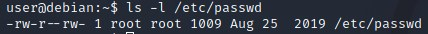
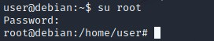
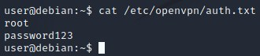
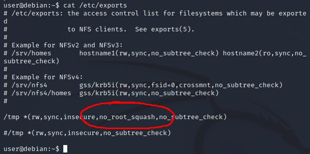

# Linux Privilege Escalation CTF Writeup

## About the Capture the Flag 
Name: Linux Privilege Escalation\
Difficulty: Easy\
Author: [Tib3rius](https://tryhackme.com/p/Tib3rius)\
Link: [LINK TO CTF](https://tryhackme.com/room/linuxprivesc)

## Start of writeup

### Introduction
With this Capture the Flag challenge, we'll be practicing our Linux privilege escalation skills on a (intentionally) misconfigured Debian virtual machine. We do this by accessing the machine through SSH. The details are given to us by the author. This is a pretty big CTF that explains all the different types of escalations.

### Goal of the CTF
The goal of this CTF is to complete every task given in the room and learn the different approaches to privilege escalation in Linux. After answering the several questions in this room, you'll complete it an retrieve a badge!

### Part I - Weak File Permissions
The first step in this CTF is exploiting weak file permissions in Linux. The first file we'll be taking a look at is the READABILITY of the /etc/shadow file. This is pretty similar to SAM file in Windows where it contains all the hashes of the users on the machine. Obviously this is a risk if it's possible to gain access to the file if you're not supposed to. When we cat the file, we're given the list of the users and their hashes. We're targeting the root user. The hash is shown in the screenshot below. Now that we have the hash it's time to use a tool to crack the hash. The tool we'll be using is John the Ripper. By using the tool we're shown a sha512crypt has been used to encrypt the password along with the plaintext password itself, giving us the answers to this part of the room.


The next part of the room focusses on the WRITEABILITY of the /etc/shadow file. The /etc/passwd file is world-writeable. This means anyone can edit the file and add to it (ls -l /etc/passwd). We'll be generating a new password hash with a password of our own choice with the help of openssl. We'll then be editing the file and replace the root's password, with our newly generated one. This now means we set the password of the root user and can easily switch to it. We'll also be creating a new root user with the name "newroot" having the same password of "foobar" that we made with openssl.







### Part II - Sudo
In the next part of this CTF we'll be diving into sudo commands you're allowed to do as a normal user on a Linux system. This is done by a simple command "sudo -l" this will display all the possible command you can execute, but what can you actually do with this? Some of these commands allow you to escalate your user role to root user. [GTFOBins](https://gtfobins.github.io/) is a website that shows all sort of possibilities for privilege escalation techniques when you have certain root access. When looking at the list of sudo commands we can execute, we can count eleven different binaries. Once we checked all the different binaries, it shows that "apache2" is the only one we can't use to gain root access. In the attached screenshot it shows how we gained root access through the find binary.


### Part III - Cron Jobs
Cron jobs are scripts/programs that are schedueled to run at specific intervals or times. Crontabs store the configuration for cron jobs. The system-wide crontab for Linux is located at /etc/crontab. We're gonna take a look at this file as shown in the screenshot below.


It shows that the PATH variable is /home/user:/usr/local/sbin:/usr/local/bin:/sbin:/bin:/usr/sbin:/usr/bin, which is the user's home directory. We'll then be creating a file called overwrite.sh which contains the following code: 

```python
#!/bin/bash

cp /bin/bash /tmp/rootbash
chmod +xs /tmp/rootbash
```

It's important the file is executable, this is done by chmodding it. We then wait for a minute or two for the cronjob to run, which allows us to get a shell with root access "/tmp/rootbash -p". 

### Part IV - SUID/SGID
This part of the CTF has no questions to answer but it's really recommended to go over this part of the room because it has a lot of useful information and fun to learn and do. For now though, we'll be moving on to the next part of the CTF, passwords and keys!

### Part V - Passwords & Keys
We start of this part of the room with the information that if a user accidentally types their password on the command line instead of a password prompt, it possibly gets logged in a history file. We can see the history of all the typed out commands with the command down below. This will results in the list in the screenshot below with the noteworthy typed out password being: "mqsql -h somehost.local -uroot -ppassword123"

```python
cat ~/.*history | less
```


The next step is focussed on the config files on Linux. These often contain plaintext passwords or in other simple, reversible formats. The first step in this room is listing the contents of the /home/user directory. This file shows that there's an .ovpn file similar to the one we use to connect to the VPN of TryHackMe to run these machines. Reading the contents of this files shows an interesting location where, according to the author of the room, the user's credentials can be found. We're then able to switch to the root user with these credentials. All these steps are shown below.




The last bit of this section of the room goes into details about important files, in this case the SSH key that's accesible for anyone. You can use this private SSH key to log into the root user with ssh -i keyfile_name root@<ip>. You'll now have access to the root account!

### Part VI - NFS
Files created with NFS (Network File System) inherit the remote user's ID. If the user is root, and root squashing is enabled, the ID will instead be set to the "nobody" user. When reading the contents of /etc/exports, it shows that /tmp has root squashing disabled. You then wanna create a mount on your Kali box and mount the /tmp share. You wanna generate a payload using msfvenom and save it to the mounted share. Make the file executable and set the SUID permission. Then as a normal user back on the Debian VM, execute the file and get the root shell.




### Conclusion
This was properly one of the bigger CTF challenges, taking me a couple of days to complete. Not because it was difficult but because it was lengthy, which I loved. It went into detail about all the different types of way to exploit mistakes made in Linux, which will definitely come in handy with future CTFs. Most were familiar to me already but I learned one or two new things! It was more of a practice room than a CTF, which makes it amazing for starters in the world of cybersecurity. Good luck and have fun!