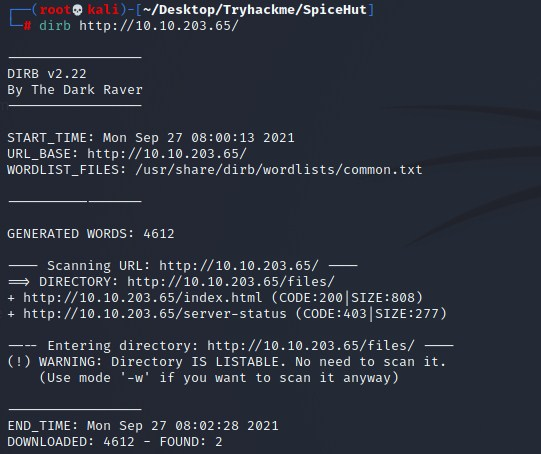
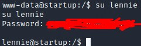

# Spice Hut Startup CTF Writeup

## About the Capture the Flag 
Name: Spice Hut Startup CTF\
Difficulty: Easy\
Author: [elbee](https://tryhackme.com/p/elbee)\
Link: [LINK TO CTF](https://tryhackme.com/room/startup)

## Start of writeup

### Introduction
Spice Hut is a beginner CTF which portrays a startup company that sells several spices and club sandwiches. The company wants you to perform a penetration test and see if you can access the root of the system to see if the developers did a good job creating the website.

### Goal of the CTF
The goal of this CTF is to answer the three questions asked in the room. You need to find the recipe for something on the site and we need to find the two flags, one for the user and one for the root.

### Welcome to Spice Hut! (Recipe, two flags)
The first objective is locating the special recipe used to make the spices the website is selling, what could it be? We'll find out! Let's start with enumerating the machine, see what's going on and what services are running on the machine. After performing this scan, it turns out there multiple services running on the machine. A FTP service on port 21, SSH on port 22 and a HTTP service on port 80. We'll be running a DIRB scan on the target to get access to all the hidden directories that are there. While that is running, let's check out the site. Nothing special to see here for now. While the scan is running we'll also check the FTP service. The NMAP scan shows us that the anonymous account is available to use. Once we access FTP with the anonymous account and no password, we can see a list of several files we can, and will download. The files are not too useful but we do see a name which might be important, a username or whatever. What we can do however is upload a reverse shell using ftp (putting it in the FTP folder). We do this by using the "put" command on FTP, uploading the PentestMonkey reverse shell, using a Netcat listener for 4444 and going to the said link. Giving us access to the system! With a quick ls command, we see the secret.txt file.

Now that we're in the system, we should see if we could elevate our privileges. We got very limited access to the system, but the thing we can access that does stand out is the incidents directory. This contains a .pcap file which is very interesting. We transfer the file from the target system to our own system. We do this by opening another nc listener and transfer the file over it. While we navigate the file, we spot an interesting piece of traffic, started on a 4444 port listener like we are doing now. Going over that file, it shows us a plaintext password which could belong to the other user, Lennie. Using this back in our shell, "su lennie", along with this password, we get access to this account. Navigating to the lennie home/user file, we're given and shown the user.txt file, giving us our second flag.

The last flag, the root flag, was the hardest to obtain. The hint the author gave was "scripts". There was a script directory in lennie's personal directory. Upon checking this file it shows us it contains a trigger that executes every minute, this file is difficult to edit but it does refer to another file, planner.sh. When we try to edit the file with a PentestMonkey cheat sheet privilege execution. We do this by echo'ing it and placing the changes in that file, since nano or vim doesn't work here. We open a new netcat listener on our host machine and after a minute, the script triggers and we're given root shell access. The last step is navigating to the root.txt file, and we got our final flag!

### Conclusion
This was a very fun and interesting CTF, but it did live up to it's difficulty level, beginner. It wasn't the hardest CTF I've done but you do learn a lot along the way, especially as a beginner. In the CTF we abused the FTP service being open, uploading a basic shell to gain access to the first flag (recipe). Locating and copying a .PCAP file to our machine to see the contents of it, revealing a password for our suspected user lennie. With these credentials we got access to the user flag, leaving us with one final flag, the root one. We did this by using the hint given by the author of the room and used the shell in the scripts file. Using the pentestmonkey cheat sheet to echo a bash reverse shell into the file that executes every minute, giving us the root.txt file! Have fun and good luck on the CTF! 